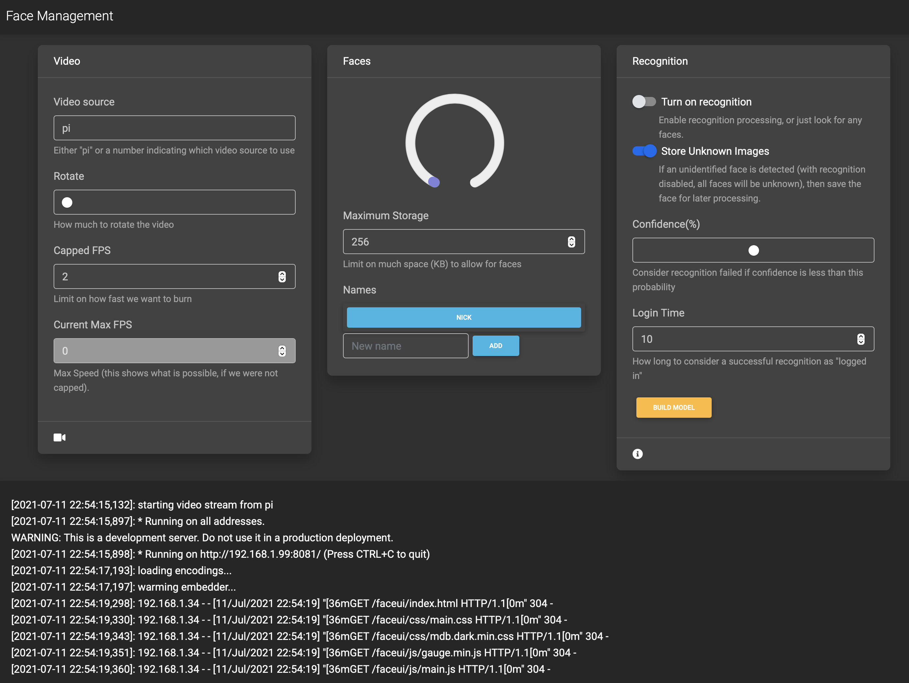
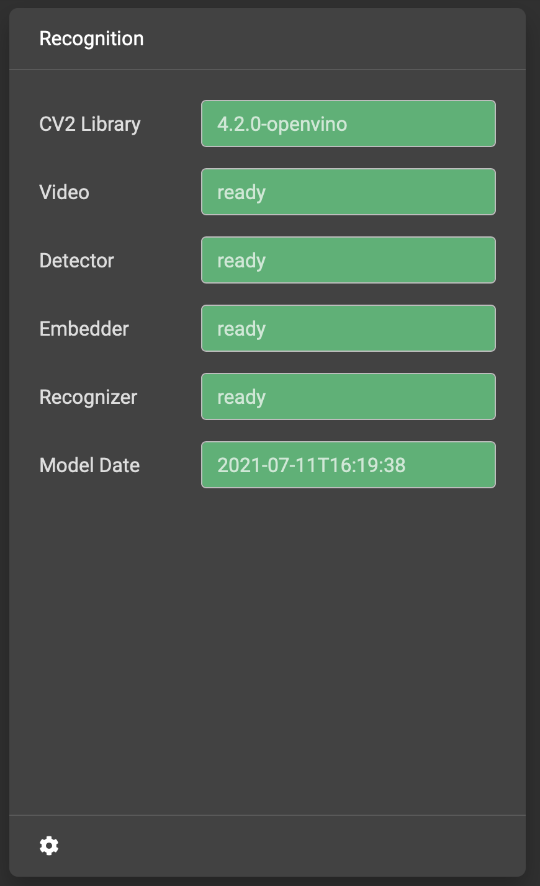
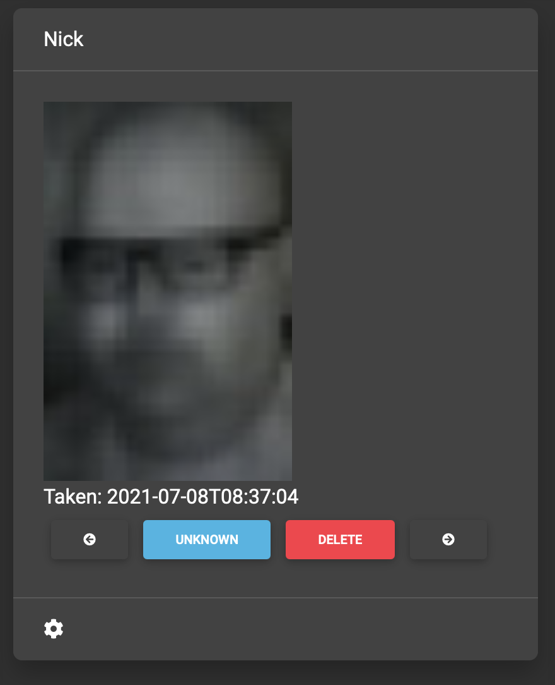
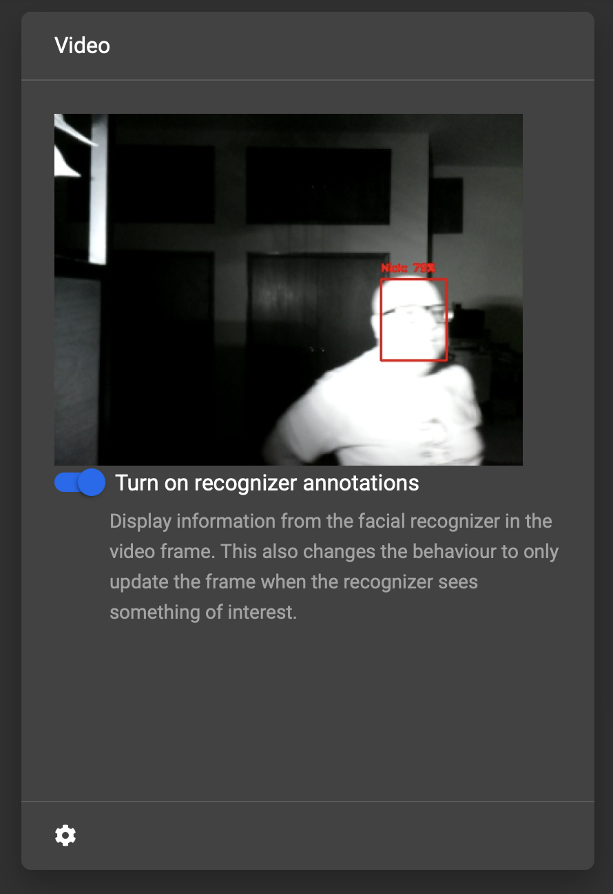

# MMM-Faces
This an extension for the [MagicMirror](https://github.com/MichMich/MagicMirror). It provides facial recognition and informs MMM-ProfileSwitcher of the current user. Without MMM-ProfileSwitcher, this module will not provide any useful effect. 

## Features

  * Uses a fast recognition network.
  * Supports hardware acceleration through Intel's Movidius compute stick (I'm generally seeing 6fps recognition on a Pi 3B+, however I need to get around to taking down the mirror in order to remove the compute stick to get some useful benchmarks...).
  * Provides a rich user interface for managing the facial recognition: capturing images, categorising, rebuilding model, and configuring the overall face recognition system. The theory is that you can configure, test and debug everything through the user interace. (UI available at http://$HOST:8081/)
  * Provides an API for managing the facial recognition should you want that (Swagger UI available at http://$HOST:8081/faceapi/1.0/ui).
  * "Simple" management (all a matter of perspective, of course).

## Background

There's a few facial recognition modules for Magic Mirror. I've tried most of them, and found them a bit painful to setup. Furthermore, the setup is something that needs to be done again and again and building and capturing the images seemed awkward. I felt that there must be an easier way of managing this, so decided to build one, and then got carried away. For other alternative implementations, take a look at...

  * https://github.com/nischi/MMM-Face-Reco-DNN
  * https://github.com/jimbydude/MMM-Face-Multi-User-Recognition-SMAI (a more active fork of https://github.com/EbenKouao/MMM-Face-Recognition-SMAI)
  * https://github.com/paviro/MMM-Facial-Recognition (abandoned)
  * https://github.com/paviro/MMM-Facial-Recognition-Tools (abandoned)
  * https://github.com/normyx/MMM-Facial-Recognition-OCV3 (abandoned)

Originally I started patching and looking at these pre-existing modules, but felt that I needed a more drastic overhaul. This is the result, yet another facial recognition module, which I've called MMM-Faces. This might change to be a standalone program (pi-faced) in the future, so I've built it with that in mind.

## Usage

This is a work in progress!!!!!

This system is designed to take all the work out of managing the building of the recognition network. You do not need to manage the AI/ML parts of this. You do not need to find images. You can start with nothing, and let the system capture images for you. You don't need to run scripts on the raspberry PI. Every now and again you should go into a user interface to categorize images to rebuild the AI/ML model if you think that it needs it. Everything you need to do should be available from that user interface. The intent is that you do not need to touch a command line in order to manage this (almost there...)

This system has been tested using an Intel "Movidius" Compute Stick for hardware acceleration. With the compute stick on a Pi 3B+, I leave the recognizer running at around 2 fps and everything seems to work really well.

In order to have a system with a real-time updating configuration, complete API and user interface, I chose to build this
outside of the usual magic-mirror framework, with just a very thin layer of integration with the magic-mirror. Therefore this magic mirror module is really a very simple shim module that 
does pretty much nothing but invoke
a new system I've called "pi-faced" that does all the actual work, and provides an interactive UI for managing
all the tasks related to managing the recognition. This is a bit of a departure from the typical Magic Mirror
modules, and it will evolve over time as I work out how to better integrate things.

The quick overview of the workflow for using this system:
1. install. This may take some time, since getting all the dependencies is definitely a pain. More work to be done here.
2. turn on the module within your Magic Mirror config.
3. check the admin UI for face management to see that it's working, and has the correct configuration for video, based
on the forms and visual cues within the admin UI.
4. use the out-of-the-box configuration of the face management for a while. Let it capture 
a set of useful images to use to train the system - this system does not assume any pre-built network or pre-built
images (since the prebuilt images would probably be with the wrong lighting, wrong setup for how I'm using this). At some
point, maybe I'll make an importer to take a set of images and import them in the right configuration if it's really
considered necessary. You certainly don't need anything like that for the default workflow. Just let the system watch you...
5. go to the admin UI for Facial Recognition. Take a look at the faces that are captured and assign them to names. If you've
got a good set of images, then click the button to rebuild the recognition models. Within the admin UI, you can then enable
the recognition module which will immediately start feeding data back into Magic Mirror about who is being recognized.
6. edit your magic mirror config to adjust the MMM-ProfileSwitcher config to achieve the desired effect based on 
who's standing in front of your mirror.
7. Go back to step 5 any time you want. If you're not interested in more training, then turn off the "capture unknown"
setting.

Let's go into more detail about all of these steps.

## 1. Install

Installing facial recognition software is a bit of a hassle.  And I'm all for compiling from source, but this takes hours,
so I've found a couple of shortcuts.
1. sudo apt-get install stuff. Not sure what's needed here yet. I need to try again since my first attempt was before I found the openvino stuff and i had to compile everything. That's not neccessary...
2. download and install the Intel OpenVino distribution as per https://docs.openvinotoolkit.org/latest/openvino_docs_install_guides_installing_openvino_raspbian.html. This avoids you having to compile all the OpenCV stuff from scratch, and gives you working integration with the Intel Movidius compute stick.
3. cd ~/MagicMirror/modules ; git clone https://github.com/njwilliams/MMM-Faces.git
4. Install any node and python requirements: cd MMM-Faces ; pip3 install -r requirements.txt ; npm install

When you install the OpenVino kit, you'll need to update the way in which you invoke Magic Mirror to make sure that you have all of the environment variables correctly configured for OpenVino. For example, if you're using pm2, then edit your start script to add the following line before the invocation of "npm start":

    source ~/openvino/bin/setupvars.sh

If you miss this step, there's no helpful error from python to say things aren't working (that I've found yet). Instead, you'll find that the Embedder will never move from state "warming..." to "ready" (you can see this status in the info in step 3 of this guide). Therefore I've made that one of the checks in the admin interface to show if you've got the right version of cv2 installed. You'll see that in the recognition status. Note that depending on what version and how it was installed, the path to the setupvars might be different, like /opt/openvivino, or something like that.

## 2. Magic Mirror Configuration (Phase 1)

At first, you want to put a really simple config into the magic mirror config, since you don't have the
recognition all working yet, and things won't wire up the way you expect, so let's start simple.
1. Install MMM-ProfileSwitcher into your config with a very simple config, based on defaults from the MMM-ProfileSwitcher setup page. Note that you should add  MMM-Faces to the ignoreModules list!
2. Install MMM-Faces into your config with even simpler config. There is no config in MagicMirror for MMM-Faces, so you just need the invocation of the module with no settings at all:
```
    {
       module: 'MMM-Faces',
    },
```
That's it!

Run Magic Mirror to see that it works without errors. It should look exactly like it used to
at this point, with no errors, no changes. If that's the case, you're doing good! If there's an
error happening here, then fix it before moving on, since we expect a working configuration at
this point. If you've fiddled with the ProfileSwitcher config, it's possible that nothing will display
on the mirror. If that's the case, it's because of the ProfileSwitcher config, nothing to do with
MMM-Faces, since we haven't yet started using it! So, if you've got just a blank screen at this point,
it means that you need to annotate your modules with classes. See the MMM-ProfileSwitcher documentation
for more information.

## 3. First Look at the FaceAdmin Interface

At this point, you should check that the recognition has everything setup in the way it needs. Is the camera
working, oriented correctly, etc. The easiest way to do this is to go the admin interface from a web browser on
the same network as your magic mirror (your phone will do). You need to know the IP address of your mirror. The admin
interface should be available at http://$HOST:8081/ (for example, http://192.168.1.99:8081/) about 30 
seconds after the magic mirror is started - it takes a while
for everything to get up and running! If you can't access the interface after a minute, then something is
probably wrong and you need to go back and check your error logs. One debug tip is to turn off auto-restart
of the magic mirror and just use the command "ELECTRON_ENABLE_LOGGING=1 npm start" to start the mirror
with all the debug, and see what kind of errors might be happening.

If all is going well, then your admin interface should look like the following:

There are four main areas here, and we'll go into more detail on each of them, but a quick tour...
1. The video configuration. There is a video icon at the bottom of this section that toggles a "live feed"
from the vide camera to check that the configuration is correct. If you get a "broken image" icon when
you look at the live feed, you should look at the logs to work out what's going wrong. Note that there
will be a "Current Max FPS". This shows you what's the best recogntion rate you might be able to achieve.
You want to keep an eye on that value to see how fast things are working, to know
how best to configure your system. 
2. The face configuration is the middle section. Here you can create new names, and set the configuration
of how much storage to use for faces.
3. The recognizer configuration panel. When first downloaded, the defaults are: 
   - have recognition disabled (it doesn't know who to recognize!), 
   - capture images of people we don't recognize for later sorting (that goes into the storage bucket
     we looked at in the face configuration panel).
   - Some recognition parameters that we can leave to default for now.
   - There's a button to rebuild the model in this section. Cool, but we have
   no data right now to build a model with, so that won't do anything useful for us yet.
4. Finally, there's a log section at the bottom of the admin UI, that provides the last 20 or so
   lines of log from the facial recognition system. All API requests, any messages from the
   recognition system, debug data, etc. This is not a live updating log. Just reload the page if you want
   to refresh the log with more recent data (You can click the logo on the top-left of the page to update
   the content, rather than a full reload)

So, from this early stage, we should see the recognition system "live" (in that the UI is working, showing
us useful log messages, and the video camera works). That's our goal for now. If one of those aspects is
not working correctly, then you'll need to troubleshoot. There are icons on the video and recognition
panels that flip over to see how stuff is working. The video panel has a camera icon at the bottom that
switches that section to show you the view through the
camera. The recognition panel has an info icon that will flip the recognition settings to
show you the status of all of the components with a quick color
coding of if things look good (grey = Neutral, not sure; red = Something's broken; green = all looks good).

Note that if you change any of the configuration for the video or the recognition, the status
will show things as being unavailable during the re-initialization of that component.

## 4. Capture Faces

This part is easy. Just occasionally look at the mirror! Go into the admin interface to check that the
capture images have reasonable quality. If you don't have enough light, you might need to illuminate
the scene. To check the images being captured, go to the admin UI and there will be an "Unknown" name
listed in the names section on the Faces configuration section. Clicking the Unknown name will flip
the card to an interface showing the captured faces. You can move through the images with the
left and right buttons, and delete any images that you don't like. By default, an unknown face
will only be captured once per minute, to avoid filling up the storage with identical pictures.
You can also go to the video feed and toggle the switch to annotate the video feed. That will
then show what the recognizer is seeing.

## 5. Facial Recognition

The recognizer needs to know which image matches which person. Go to the admin UI and within the
faces configuration section is a entry to add a new name into the system. Add the names of the
people that you want to recognize. The exact text of that name is what will be sent to the magic
mirror identifying a profile.

Once you've created your names, click the "Unknown" names button to look at the unknown
images. When looking at unknowns, you will find blue buttons for every name. Clicking
a specific name will assign that image to the given name.  If you get it wrong, you can go back
to the face config and click on the user, and run through the faces there. Each face there has
a blue button to mark the face back to "unknown" for re-categorization.


Once you've categorized the images, you can build a recognition model by clicking the "Build
Model" button in the recognition configuration section. This takes about a minute for a typical
configuration: around 4 names, each with around 10-20 images. Once the model is built, you
can flick the slider for "Turn on recognition" and see how well the camera does at recognizing
you! Within the video tab, you can also click the slider to show only frames that have
faces.


## 6. Turn things on!

Okay, so have a facial recognition model built and things should work. Time to try it out!
What's happening now is that any time a face is detected, then a request will be sent to 
MMM-ProfileSwitcher to set a specific profile. If the face was recognized, then the profile
will be the name set in the Face management UI. If the face was not recognized, then
the profile will be called "unknown".

MMM-ProfileSwitcher will activate the appropriate profiles based on that name. So, 
You can edit the config of magic mirror to put in names into each section, by adding a
className to every section of the mirror. For example, if you only want the calendar to
be visible to Nick, then set className="Nick" in the calendar module. If you want the
calendar to be visible to everyone, then set className="everyone". I find that the useful
bit of config to have in MMM-ProfileSwitcher is:

```
    ignoreModules: ['MMM-ProfileSwitcher', 'MMM-Faces'],
    everyoneClass: 'everyone',
```

Note that you really need to make sure to add MMM-ProfileSwitcher and MMM-Faces into the
ignore list, otherwise the mirror won't wake up anything...

## 7. Rinse and repeat

You might look up from your mirror and find some friends one day. You can add their faces
into this by going back to step 5. If you have no reason to add any other faces into
the recognizer, then you can go back into the admin UI and turn off "Store Unknown Images"
and then leave everything working in that state for as long as you want.

## Tips and Tricks

The face management system limits capturing unknown faces to the capped amount specified
in the storage configuration. This is by default 256KB. If you forget to turn off the
"Store Unknown Images" options, and unknown images keep getting created, once you hit
the limit it will stop adding any new images into the store. If you want to be able to
start capturing again, you'll need to free up some space first by deleting images.

The maxFPS setting allows you to calm down the processing. Depending on your hardware,
you might be able to get real-time recognition running quite happily. However, you might
find that you don't need real-time recognition - it will burn more power and heat that way,
so it's better to limit the processing down to a value that is still effective without
being wasteful.

